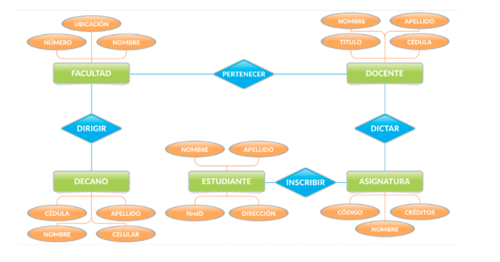

# Ejercicio Diagrama Entidad Relación

Alumno: Flavio Lionel Rita

## Objetivos

Desarrollar habilidades para identificar y analizar relaciones en bases de datos estructuradas.

## Consigna

### 1. Identificación de claves primarias y secundarias en el siguiente diagrama, explica cual es PK y FK de cada tabla y por medio de que FK se relacionan cada una de ellas

**Solución:**

- Facultad:
  - PK: Numero
- Docente:
  - PK: Cédula
  - FK: Numero (Facultad)
- Decano:
  - PK: Cédula
  - FK: Numero (Facultad)
- Asignatura:
  - PK: Código
  - FK: Cédula (Docente)
- Estudiante:
  - PK: NroID
  - FK: Código (Asignatura)

### 2. Colocar la relación

- UNO A UNO
- UNO A MUCHOS
- MUCHOS A MUCHOS

**Solución:**

- Facultad - Docente: UNO A MUCHOS
- Facultad - Decano: UNO A UNO
- Docente - Asignatura: UNO A MUCHOS
- Asignatura - Estudiante: MUCHOS A MUCHOS

## Bibliografía utilizada y sugerida

[Modelado de una Base de Datos (DER - MR) - Modelado de una  Base de Datos Autor: Alfonso Palomares. (n.d.). Studocu. Retrieved March 11, 2023, from] (https://www.studocu.com/es-mx/document/universidad-virtual-del-estado-de-guanajuato/base-de-datos/modelado-de-una-base-de-datos-der-mr/26181834)
